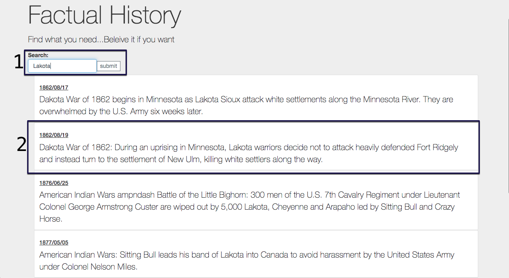

# Factual History

### A quick and easy history "fact" finder.

### Getting Started:

###### Install Dependancies -
```
$ npm install
```

###### Start server
```
$ npm start
```
-- Server will start on port 3000.

-- Navigate to http://localhost:3000 and begin searching.

###### Layout




1. Search Bar and Submit button.
  -- returns history results based on key word searched.

2. Historic tidbits.
  -- All entries matching search phrase. Sorted by year and paginated at 10/page.

3. Page Nav Bar
  -- Nav bar for navigating results

###### Built with:
- JavaScipt
- React
- react-paginate
- json-server
- Bootstrap